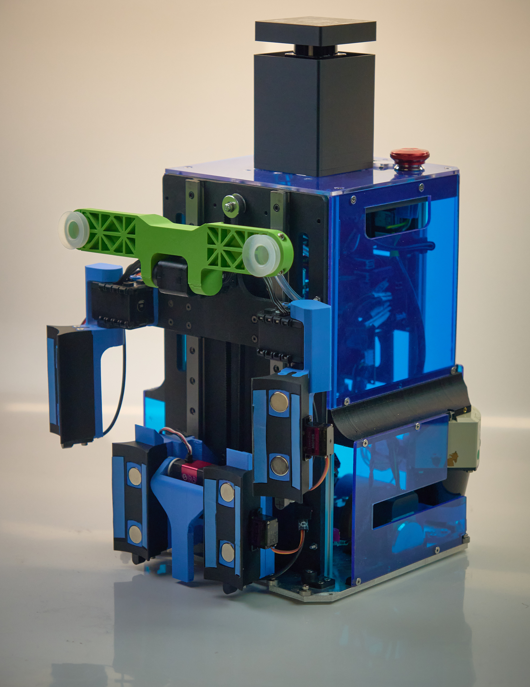
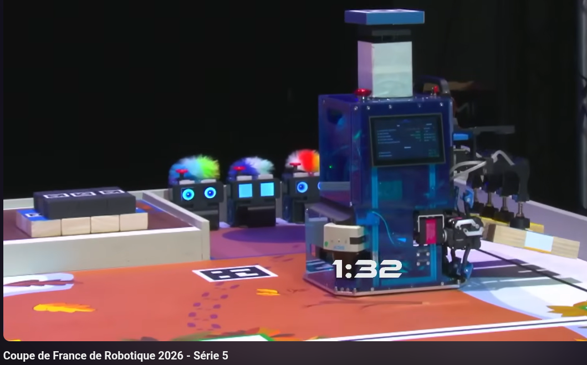
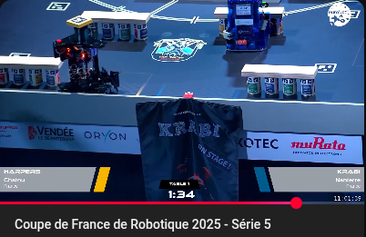
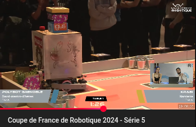
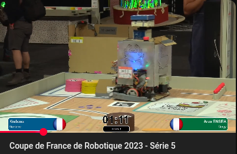
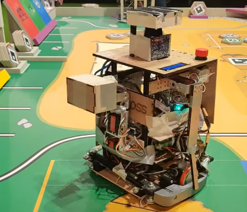
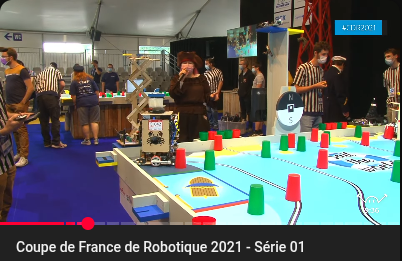
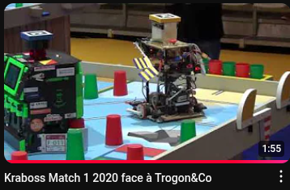

<!--toc:start-->
- [Description](#description)
- [Documentation](#documentation)
- [Clone](#clone)
- [Update](#update)
- [Build](#build)
  - [Install dependencies](#install-dependencies)
  - [Compile workspace](#compile-workspace)
- [Run](#run)
- [The robot in action](#in-action)
<!--toc:end-->

# Description

This is a meta-package, containing the various packages needed
for the Krabi/Kraboss robot.
These packages are git submodules for this packages



# Documentation

===> [Have a look at the wiki](https://github.com/VictorDubois/krabi/wiki) <===

# Clone

- If you do not already have a ROS 2 workspace, create it: `mkdir -p krabi_workspace/src && cd krabi_workspace/src`
- go to your workspace's src folder
- `git clone git@github.com:VictorDubois/krabi.git --recurse-submodules`

If you have just cloned it regularly (without --recurse-submodules),
you can still init the submodules:

- `git submodule update --init --recursive`

# Update

To update the submodules, once initialized:

- `git submodule update --recursive`

# Simulation

- `sudo apt-get install ros-${ROS_DISTRO}-ros-gz`
- Clone this additionnal repository in krabi_workspace/src: https://github.com/VictorDubois/krabby_description 

(It is not in the Krabi meta-package, as it does not run on the real robot)

# Build

## Install dependencies
Go to the workspace (krabi_workspace), then:

```shell
rosdep install --from-paths src -y --ignore-src  --skip-keys="krabilib"
sudo apt-get install ros-$ROS_DISTRO-diagnostic-updater
sudo apt install python3-colcon-common-extensions
```

## Compile workspace

```shell
colcon build --merge-install --symlink-install --cmake-args '-DCMAKE_BUILD_TYPE=RelWithDebInfo' '-DCMAKE_EXPORT_COMPILE_COMMANDS=On' -Wall -Wextra -Wpedantic
```
(see alias krabuild bellow)


## Usefull aliases
- `alias krabi="source /opt/ros/jazzy/setup.bash && cd <path_to_workspace> && source install/local_setup.bash && export GZ_PARTITION=krabigz && export ROS_DOMAIN_ID=0` 
- `alias krabiSimu="krabi && ros2 launch krabi_description spawn_world.py gui:=False"` 
- `alias krabiRun="krabi && ros2 launch krabi_bringup krabi_launch.py xRobotPos:=-1.25  yRobotPos:=-0.75 zRobotOrientation:=1.570796327 isBlue:=True use_aruco:=False use_lidar_loc:=False"`
- `alias krabiRunAndSimu="krabi && ros2 launch krabi_bringup krabi_start_simu.py gui:=False xRobotPos:=-1.25  yRobotPos:=-0.75 zRobotOrientation:=1.570796327 isBlue:=True use_aruco:=False use_lidar_loc:=False"` (option: world:=table2026Full.world pour avoir les éléments de jeu)
- `alias krabuild="colcon build --merge-install --symlink-install --cmake-args '-DCMAKE_BUILD_TYPE=RelWithDebInfo' '-DCMAKE_EXPORT_COMPILE_COMMANDS=On' -Wall -Wextra -Wpedantic"`
- `alias krabiTest="krabuild && colcon test --packages-skip ros2_aruco ros2_aruco_interfaces"`

## Run
To run the robot within the simulation do:
- krabiRunAndSimu

## Test
To run the unit tests (currently takes about 1min):
- krabiTest

# Other repositories

## Startup scripts
[Used to configure the Raspberry Pi 5 on which this code runs](https://github.com/VictorDubois/krabi-startscripts)

## Motor board code
[STM32 code for handling the motors (DC or C610)](https://github.com/VictorDubois/Motor-board-STM32-CAN)

## Actuators board code
[ESP32-based PCB to handle sensors and actuators](https://github.com/VictorDubois/ActuatorBoardCode)

## GUI
[Python GUI, on a touchscreen](https://github.com/VictorDubois/krabi_gui)

# In action
## Current team

### 2026
[](https://www.youtube.com/live/k5Suqyi1aqE?si=t0wPnNDIbidcl6yX&t=4865)
[Match 4](https://www.youtube.com/live/jrfmvH_gVxM?si=-OrE-Z2rjjJDkdj4&t=2375)
[Match 3](https://www.youtube.com/live/ISvunlsdgDo?si=CKgdjh3TMWmhJz42&t=5856)
[Match 2](https://www.youtube.com/live/pXuNJs7dAxo?si=_xTv7n_fmkTlCHpk&t=5827)
[Match 1](https://www.youtube.com/live/HS5AkY2gTb8?si=WX2xgn9Y3OPDOvQD&t=4516)

### 2025
[](https://www.youtube.com/live/5oetXN7tdYc?si=Os8TLiERuT9G4-z0&t=6761)
[Match 4](https://www.youtube.com/live/fv44r3pMlkQ?si=96i0OfI4LxI49Apz&t=5208)
[Match 3](https://www.youtube.com/live/l07-lDl3Wkc?si=T8Q6WBRdA1UdYvWr&t=4547)
[Match 2](https://www.youtube.com/live/dB690W-MNmo?si=-2CfpFBirP8OpQIo&t=2544)
[Match 1](https://www.youtube.com/live/Eyukl6GLJhc?si=FdVLnM0cjb9-PBAN&t=5005)

### 2024
[](https://www.youtube.com/live/e8N0uOuQXZI?t=3810s)
[Match 4](https://www.youtube.com/live/PJYNJFExOm4?si=iLKp-Fqe3UfO6Gs3&t=2072)
[Match 2](https://www.youtube.com/live/8zZkLfBQLeM?si=Owq2L8tC4nwCi5UG&t=3565)
[Match 1](https://www.youtube.com/live/H6KzbwScAOg?si=vCV4GToK_qwrhpnD&t=2730)

### 2023
[](https://www.youtube.com/watch?v=PNqFieVEhVM&t=1394s)
[Match 3](https://www.youtube.com/live/gZ_d-zA0fbQ?si=UixXtcgI7DYyCJxr&t=2634)
[Match 2](https://www.youtube.com/live/hH7pSExuaw4?si=-FF7S3wx4F7Ug5hc&t=4787)

### 2022
[](https://www.youtube.com/watch?v=QfEznDc24sY)

### 2021
[](https://www.youtube.com/watch?v=ZFVgK0XuA1k&t=1938s)

### 2020
[](https://www.youtube.com/watch?v=_Oi5cUh8nhQ&list=PLKfOj1_S1GX3FbhYTOglL9QyVVqv39oAK&index=2)

### 2019
[](https://www.youtube.com/watch?v=ugoAqQ8jtyk&list=PLKfOj1_S1GX3_s_kSwCwgHOziNBIUpHdu&index=4)

## Historic teams
### 2017 (4g1c)
No videos worth showing :'(

### Krabi - Télécom Bretagne
[Krabi 2015](https://www.youtube.com/watch?v=8FZDxJf1kX4&list=PLKfOj1_S1GX2-rUcaLzfm8mEDs_qTDlhd&index=5)

[Krabi 2014](https://www.youtube.com/watch?v=12qLPsQLWvM&list=PLKfOj1_S1GX1pSSYhAHeNt8jKM_09mP8X&index=1)

[Krabi 2013](https://www.youtube.com/watch?v=zmZXw1wOLYo&list=PLKfOj1_S1GX0xs9SVw4AWFK5KCqnZ67yk&index=2)

[Krabi 2012: 24th!](https://www.youtube.com/watch?v=_AFnXjqmlcM&list=PL816CB88CF131B2B4&index=3)

[More on the Youtube channel](https://www.youtube.com/@krabifamily)
